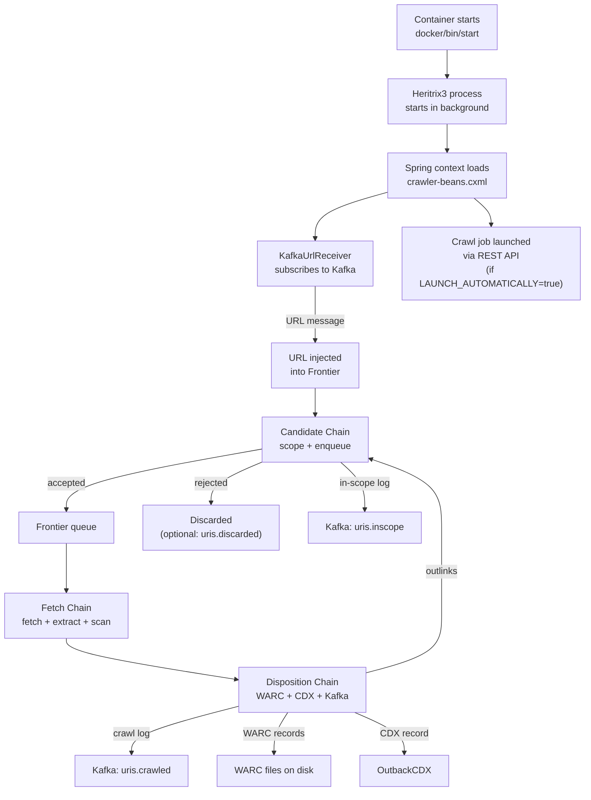

# 03 — Runtime Flow

## How the Container Starts

When the Docker container starts, the `CMD` runs `docker/bin/start`. This script:

1. Optionally starts Filebeat log shipping (if `MONITRIX_ENABLED=true`).
2. Ensures the SURT scope file exists on disk (creates an empty file if needed).
3. Registers a SIGTERM handler so that receiving SIGTERM will trigger a clean job stop via the Heritrix REST API.
4. Starts Heritrix3 in the background (`/h3-bin/bin/heritrix`) with credentials and job directory.
5. If `LAUNCH_AUTOMATICALLY=true`, waits ~45 seconds for Heritrix to initialise, then issues a `curl` launch command via the Heritrix REST API.
6. If `LAUNCH_AUTOMATICALLY=resume`, resumes a previously checkpointed job instead.
7. Waits on the Heritrix process until it exits, then returns its exit code.

Heritrix reads its job configuration from `/jobs/frequent/crawler-beans.cxml`. All runtime parameters are read from environment variables at Spring context startup.

## Kafka URL Input

Once the job is running, Heritrix does not use a traditional seeds file. Instead, `KafkaUrlReceiver` subscribes to the configured Kafka topic (`uris.tocrawl` by default). URL messages arrive as JSON objects containing the URL, hop type, whether it is a seed, and optional metadata. These are injected directly into the frontier.

Operators submit URLs to the crawler by publishing messages to the Kafka topic (e.g. using the `crawl-streams` utility).

## URL Processing Pipeline

Each URL enqueued in the frontier passes through three processor chains in sequence:

### 1. Candidate Chain
Applied when a URL is _discovered_ (before it is enqueued).

- **Scope check** — Applies the ordered set of SURT, regex, hop-path, geo-IP, and recently-seen rules. URLs that fail scope are discarded; accepted URLs are passed to the frontier.
- **Quota propagation** — Propagates quota-reset annotations to related URIs.
- **In-scope feed** — Publishes accepted URLs to the `uris.inscope` Kafka topic.

### 2. Fetch Chain
Applied when the URL's turn in the queue comes up.

- Quota enforcement and prerequisite checks (e.g. robots.txt must be fetched first).
- Optional browser rendering via `WrenderProcessor` — if this succeeds, the rest of the fetch chain is skipped.
- Standard HTTP fetch via `FetchHTTP`.
- Link extraction from HTTP headers, HTML, CSS, XML, sitemaps, JSON, and Flash.
- IP and country-code annotation.
- Virus scanning via ClamAV.

### 3. Disposition Chain
Applied after the fetch.

- **URI forgetting** — Removes the URL from the uniqueness filter so it can be re-crawled later.
- **Crawl log feed** — Publishes the crawl outcome to the `uris.crawled` Kafka topic.
- **WARC writing** — Writes normal content to `warcs/`; routes ClamAV-flagged content to `viral/` instead.
- **OutbackCDX persist** — Records the URL, digest, and timestamp in OutbackCDX.
- **Candidate feed** — Optionally publishes discovered outlinks back to Kafka.
- **Outlink processing** — Passes discovered outlinks through the candidate chain.
- **Stats and politeness** — Updates per-host statistics and enforces crawl delays.

## Runtime Configuration

All configurable values are read from environment variables when the Spring context starts. They cannot be changed without restarting the crawler (except for the SURT scope files, which are polled on disk at a configurable interval).

Frontier and URI-uniqueness-filter implementations are selected by importing a different XML fragment, controlled by two environment variables:

- `FRONTIER_BEANS_XML` — defaults to `frontier-bdb.xml`
- `URIUNIQFILTER_BEANS_XML` — defaults to `uriuniqfilter-bdb.xml`

## Local vs. Production Differences

| Aspect | Local (docker-compose) | Production |
|---|---|---|
| URL submission | Via `crawl-streams` CLI or robot test | Via the UKWA crawl orchestration system publishing to Kafka |
| Scope files | `docker/shared/surts.txt` mounted at `/shared/surts.txt` | Managed scope files mounted from the host |
| WARC output | `./target/integration-test-volumes/output` | Shared filesystem / storage |
| Monitoring | Optional Prometheus endpoint (`:9119`) | Scraped by Prometheus; alerts via UKWA ops tooling |
| Log shipping | Filebeat (disabled by default) | Enabled in production |

## Runtime Flow Diagram

