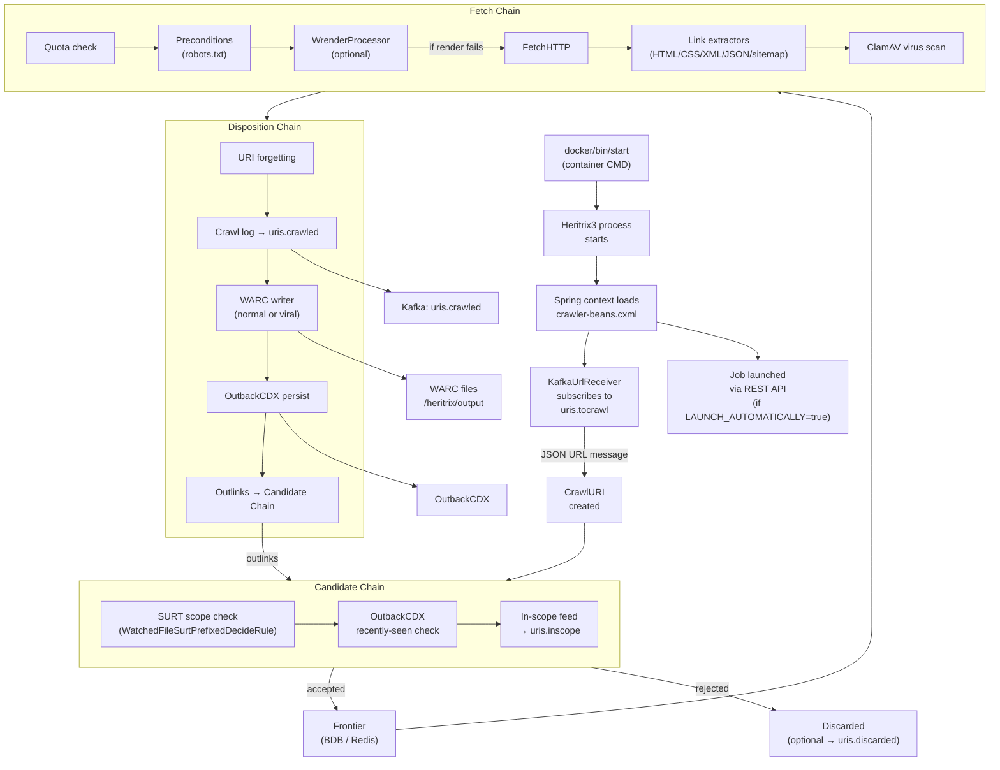
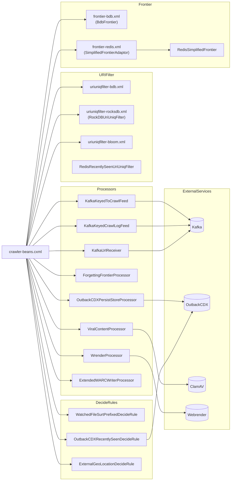
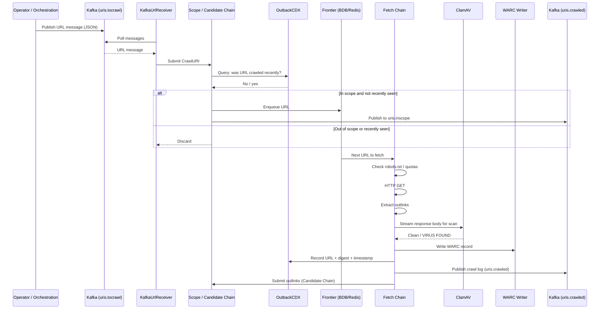

# 08 — Diagrams

## 1. Runtime Flow

How the crawler starts, receives URLs, and processes them end to end.

---

## 2. Module / File Interaction

How the main Java modules and configuration files relate to each other.

---

## 3. Sequence Diagram: URL Crawled End-to-End

The most important single behaviour: a URL arrives from Kafka and is fetched and recorded.

